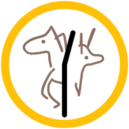

# hour-to-chinese-zodiac



[![Commitizen friendly][commitizen-image]][commitizen-url]
[![XO code style][codestyle-image]][codestyle-url]

[![NPM version][npm-image]][npm-url]
[![Build Status][build-image]][build-url]
[![Coveralls Status][coveralls-image]][coveralls-url]

> Convert hour to [chinese zodiac][wiki-chinese-zodiac] name: 8 → 'dragon'

Demo: [vovanr.github.io/hour-to-chinese-zodiac][demo]

## Install

```shell
npm install --save hour-to-chinese-zodiac
```

## Usage

```js
var hourToChineseZodiac = require('hour-to-chinese-zodiac');

hourToChineseZodiac(8);
//=> 'dragon'

hourToChineseZodiac(3);
//=> 'tiger'

hourToChineseZodiac();
//=> ''
```

## License
MIT © [Vladimir Rodkin](https://github.com/VovanR)

[wiki-chinese-zodiac]: https://en.wikipedia.org/wiki/Chinese_zodiac#Hours
[demo]: https://vovanr.github.io/hour-to-chinese-zodiac

[commitizen-url]: https://commitizen.github.io/cz-cli/
[commitizen-image]: https://img.shields.io/badge/commitizen-friendly-brightgreen.svg?style=flat-square

[codestyle-url]: https://github.com/xojs/xo
[codestyle-image]: https://img.shields.io/badge/code_style-XO-5ed9c7.svg?style=flat-square

[npm-url]: https://npmjs.org/package/hour-to-chinese-zodiac
[npm-image]: https://img.shields.io/npm/v/hour-to-chinese-zodiac.svg?style=flat-square

[build-url]: https://github.com/VovanR/hour-to-chinese-zodiac/actions/workflows/test-workflow.yml
[build-image]: https://img.shields.io/github/actions/workflow/status/vovanr/hour-to-chinese-zodiac/test-workflow.yml?style=flat-square

[coveralls-url]: https://coveralls.io/r/VovanR/hour-to-chinese-zodiac
[coveralls-image]: https://img.shields.io/coveralls/VovanR/hour-to-chinese-zodiac.svg?style=flat-square
